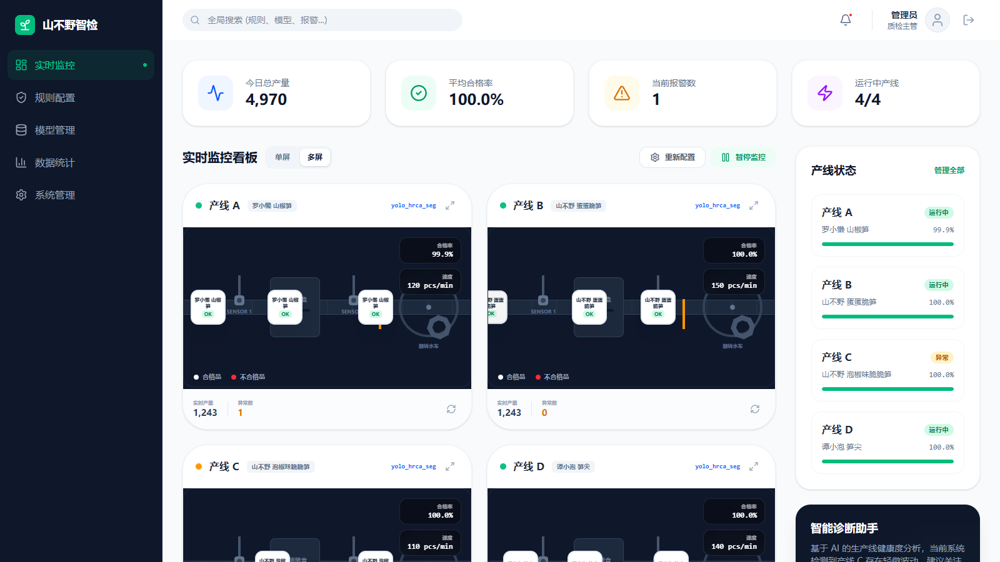
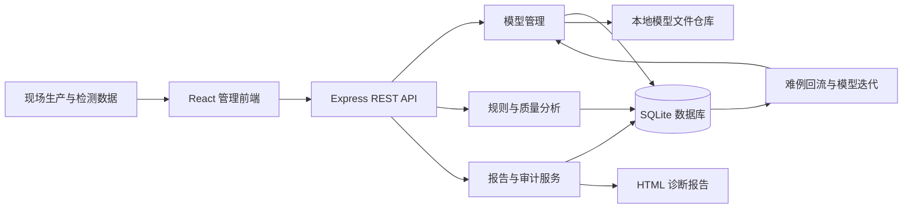

# 山不野智能包装质检管理平台

> 面向笋类食品高速包装产线的智能视觉质检管理平台

山不野智能包装质检管理平台围绕“生产监控—缺陷判定—模型迭代—质量分析—管理追溯”构建完整业务闭环。平台以 `yolo_hrca_seg` 为当前生产模型，通过统一的模型版本管理、规则配置、诊断报告、统计导出和审计日志，为质检人员、生产主管及系统管理员提供集中式数字化管理能力。

本仓库为可独立运行的本地提交包，包含前后端源码、生产构建产物、SQLite 演示数据库、系统生成的诊断报告样例、平台截图及项目演示 PPT。



## 一、项目定位

传统食品包装质检通常存在人工抽检覆盖率有限、缺陷标准不统一、模型更新难以追踪、质量数据分散等问题。本项目面向高速包装生产场景，将视觉检测模型和质量管理流程统一到一个平台中，重点解决以下问题：

- 集中查看多条产线的产量、良率、速度和异常状态；
- 统一维护缺陷识别规则、阈值和发布版本；
- 管理模型上传、验证、切换、下载、归档及复用；
- 将检测数据回流为难例样本，支撑后续模型迭代；
- 自动生成诊断报告，并导出统计数据和审计日志；
- 通过本地化数据仓库保留完整业务记录，便于追溯和演示。

## 二、项目特色

1. **模型迭代可视化**：统一展示基线版、轻量版和当前生产版的 mAP、FPS、状态及迭代说明。
2. **管理闭环完整**：覆盖模型、规则、统计、报告、系统设置和操作审计，而非单一检测页面。
3. **真实文件流转**：上传的模型文件写入本地模型仓库，可原样下载、激活或删除。
4. **真实数据持久化**：模型元数据、规则、报告、设置、用户和审计日志均保存至 SQLite。
5. **部署操作简单**：提供 Windows 一键启动和一键关闭脚本，自动安装依赖、构建程序并选择空闲端口。
6. **防重复运行**：重复点击启动脚本会复用已有实例；每次启动生成独立日志，避免文件占用冲突。
7. **笋产业主题设计**：界面围绕笋类食品生产场景展开，整体风格克制、清晰，适合企业展示和竞赛答辩。

## 三、系统架构



平台按四个逻辑层组织：

| 层级 | 主要职责 | 当前实现 |
| --- | --- | --- |
| 采集接入层 | 汇总产线、检测及设备状态 | 提供多产线演示数据接口与监控界面 |
| AI 推理层 | 管理分割模型和推理版本 | `yolo_hrca_seg` 模型族、上传、测试、切换、下载与删除 |
| 质量决策层 | 缺陷阈值、规则发布和异常判断 | 规则新增、编辑、复制、启停、导入、导出与发布 |
| 数据服务层 | 数据持久化、统计、报告和审计 | Express API、SQLite、CSV 导出、HTML 报告和操作日志 |

## 四、技术栈

### 前端

- React 19
- TypeScript 5.8
- Vite 6
- Tailwind CSS 4
- Recharts 3
- Motion
- Lucide React

### 后端与数据

- Node.js 20+
- Express 4
- TypeScript / TSX
- SQLite
- better-sqlite3
- 本地文件模型仓库
- HTML、CSV 文件导出

### 工程与部署

- npm / package-lock 依赖锁定
- Windows Batch + PowerShell 一键启停
- 动态端口检测（3000—3099）
- PID、端口及生命周期锁管理
- 独立时间戳运行日志

## 五、核心功能

### 1. 生产线实时监控

- 展示总产量、缺陷率、运行产线和报警数量；
- 展示多条笋类食品包装产线的状态、产品、良率和速度；
- 支持单屏和多屏信息展示；
- 支持刷新、全屏查看和报警提示；
- 可基于当前产线状态生成诊断报告。

### 2. 模型管理与迭代

- 上传真实模型文件，单文件上限为 250 MB；
- 支持 ONNX、TensorRT Engine、PyTorch 及通用二进制文件；
- 保存模型名称、迭代版本、mAP、FPS、备注和文件信息；
- 支持测试验证、生产切换、下载复用、删除和历史版本管理；
- 通过统一指标对比展示不同模型版本之间的提升与取舍。

内置模型元数据如下：

| 模型 | 版本定位 | mAP | FPS | 默认状态 |
| --- | --- | ---: | ---: | --- |
| `yolo_hrca_seg_baseline` | 初始分割基线，用于回归对照 | 94.1% | 118 | 已归档 |
| `yolo_hrca_seg_lite` | 面向边缘设备的轻量复用版 | 96.5% | 182 | 测试中 |
| `yolo_hrca_seg` | 融合 HRCA 的当前生产版 | 98.2% | 145 | 生产中 |

> 上表为平台内置的演示元数据，用于展示模型迭代关系，不替代真实测试集、训练日志或第三方评测报告。提交包不伪造模型权重；真实权重应通过“上传新模型”功能导入。

### 3. 检测规则与分拣策略

- 新增和编辑缺陷检测规则；
- 配置规则类型、判断阈值、启用状态和版本；
- 复制现有规则形成可复用策略；
- 批量发布规则；
- 支持 JSON 导入和导出。

### 4. 质量统计与数据导出

- 展示质量趋势和缺陷分布；
- 查看检测明细和产线数据；
- 导出 CSV 统计文件；
- 为生产复盘、质量分析和模型迭代提供数据依据。

### 5. 诊断报告

- 根据当前产线状态生成诊断结论；
- 记录报告编号、生成时间、摘要及文件路径；
- 生成可独立打开的 HTML 报告；
- 支持报告下载和归档。

### 6. 系统管理与审计

- 创建用户并配置业务角色；
- 管理报警阈值、图像留存周期和 WebSocket 地址等参数；
- 持久化记录模型、规则、报告及系统设置操作；
- 查询和导出 CSV 审计日志。

## 六、项目结构

```text
山不野智能质检平台-上传包/
├── frontend/                       # React、TypeScript 前端工程
│   ├── src/
│   │   ├── components/             # 布局、弹窗、通知和生产线动画
│   │   ├── lib/                    # API 请求与下载工具
│   │   ├── pages/                  # 监控、模型、规则、统计和系统页面
│   │   ├── App.tsx
│   │   ├── main.tsx
│   │   ├── index.css
│   │   └── types.ts
│   ├── index.html
│   ├── tsconfig.json
│   └── vite.config.ts
├── backend/
│   └── server.ts                   # REST API、SQLite、报告与静态服务
├── model/                          # 模型命名和迭代说明
├── data/
│   ├── inspection.db              # 可直接演示的 SQLite 数据库
│   ├── models/                    # 运行时上传的真实模型文件
│   └── reports/                   # 系统生成的诊断报告样例
├── dist/                           # 已完成的生产构建产物
├── docs/                           # 开发和功能说明
├── presentation/                   # 项目演示 PPT
├── screenshots/                    # 平台截图与产线配图
├── scripts/                        # 一键启停内部脚本
├── .env.example
├── .gitattributes
├── .gitignore
├── package.json
├── package-lock.json
├── 提交文件清单.txt
├── 一键启动.bat
└── 一键关闭.bat
```

## 七、快速开始

### 环境要求

- Windows 10 或 Windows 11
- Node.js 20 或更高版本
- npm（随 Node.js 安装）

本地运行无需预先安装 MySQL、Redis、Java 或 Python。

### 方式一：一键启动（推荐）

1. 解压整个提交包，保持目录结构不变；
2. 双击根目录的 `一键启动.bat`；
3. 首次运行会自动执行 `npm install` 和生产构建；
4. 服务启动后自动打开浏览器；
5. 使用结束后双击 `一键关闭.bat`。

启动脚本会优先使用 3000 端口。若端口已占用，将逐个测试并选择 3000—3099 范围内的可用端口。

### 方式二：命令行运行

```bash
npm install
npm run build
npm start
```

开发模式：

```bash
npm install
npm run dev
```

代码检查：

```bash
npm run lint
```

## 八、数据存储

系统使用 `data/inspection.db` 保存业务数据，主要数据表包括：

| 数据表 | 用途 |
| --- | --- |
| `models` | 模型版本、指标、状态和文件信息 |
| `rules` | 缺陷规则、阈值、版本和启用状态 |
| `audit_logs` | 系统操作审计记录 |
| `reports` | 诊断报告索引和文件路径 |
| `settings` | 系统参数配置 |
| `users` | 本地用户和角色信息 |

运行过程中还会产生：

- `data/models/`：用户上传的模型文件；
- `data/reports/`：平台生成的 HTML 诊断报告；
- `logs/`：按启动时间区分的标准输出和错误日志；
- `.server.pid`、`.server.port`：当前后台服务状态文件。

备份或迁移前应先执行 `一键关闭.bat`，随后整体复制 `data/` 目录。

## 九、主要 API

| 模块 | 代表接口 | 说明 |
| --- | --- | --- |
| 生产监控 | `GET /api/stats`、`GET /api/lines` | 获取平台统计与产线状态 |
| 模型管理 | `/api/models` | 查询、上传、测试、激活、下载和删除模型 |
| 规则管理 | `/api/rules` | 新增、编辑、复制、发布、导入和导出规则 |
| 诊断报告 | `/api/reports` | 生成并下载 HTML 诊断报告 |
| 质量统计 | `GET /api/statistics/export` | 导出质量统计 CSV |
| 审计日志 | `/api/logs` | 查询并导出审计日志 |
| 系统管理 | `/api/settings`、`POST /api/users` | 管理参数和用户 |

当前接口面向本地或受信任内网演示环境，尚未集成 Swagger、JWT 或企业统一身份认证。

## 十、真实实现与演示边界

为保证项目描述准确，当前版本按以下边界交付：

### 已真实实现

- 前后端程序和 REST API；
- SQLite 数据持久化；
- 模型二进制文件上传、存储、下载和删除；
- 模型状态切换与版本元数据管理；
- 规则增改、复制、导入、导出和发布；
- HTML 诊断报告生成与下载；
- CSV 统计及审计日志导出；
- Windows 一键启停、防重复启动和独立日志。

### 当前为演示或待接入

- 产线产量、良率、速度及报警为本地演示数据；
- 模型测试结果为管理流程演示，未在本提交包内执行真实 GPU 推理；
- 相机、PLC、翻转挡板和 WebSocket 现场设备接口需结合企业设备协议接入；
- 真实训练代码、训练数据集和大型模型权重未包含在本源码提交包中；
- 当前未实现企业级登录认证、RBAC 权限校验和数据加密传输。

## 十一、常见问题

### 1. 提示端口被占用

启动脚本会自动测试 3000—3099 端口，无需手动修改。启动成功后的实际地址会显示在窗口中，并记录于 `.server.port`。

### 2. 提示文件被另一个程序使用

新版脚本已采用生命周期锁和独立时间戳日志。请先运行 `一键关闭.bat`，等待提示关闭成功后再重新启动。

### 3. 首次启动时间较长

首次运行需要安装 npm 依赖并完成前端生产构建，具体时间取决于网络和计算机性能。

### 4. 启动失败如何排查

查看启动窗口给出的日志路径，或打开 `logs/` 中时间最新的 `.err.log` 文件。

### 5. 为什么提交包没有模型权重

模型权重通常体积较大，并且当前工作区没有可验证的正式权重文件。为避免使用虚假文件，本提交包仅保留模型版本关系和真实上传入口。

## 十二、后续计划

- [ ] 接入真实相机、PLC 和分拣设备协议；
- [ ] 集成 `yolo_hrca_seg` 推理服务和 GPU 性能采集；
- [ ] 建立难例样本审核、标注和训练任务流；
- [ ] 增加 JWT 登录、RBAC 权限和企业统一身份认证；
- [ ] 增加 WebSocket 真实状态推送和报警处置闭环；
- [ ] 增加 PDF、Excel 报表和更多质量分析维度；
- [ ] 完善自动化测试、容器化部署和生产环境监控。

## 十三、提交材料

- 项目演示文稿：`presentation/山不野-项目演示.pptx`
- 平台截图：`screenshots/平台实时监控.png`
- 生产线配图：`screenshots/生产线架构示意.png`
- 完整提交清单：`提交文件清单.txt`

## 十四、使用说明

本项目用于高校竞赛、企业方案验证和本地演示。诊断报告用于辅助生产判断，最终处置应结合现场设备状态、人工复核结果和企业质量标准。

如需公开上传，请确认演示数据、企业名称、图片和模型文件已经获得相应授权。
